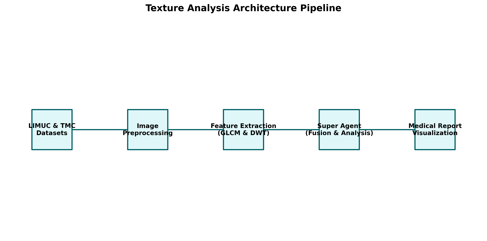
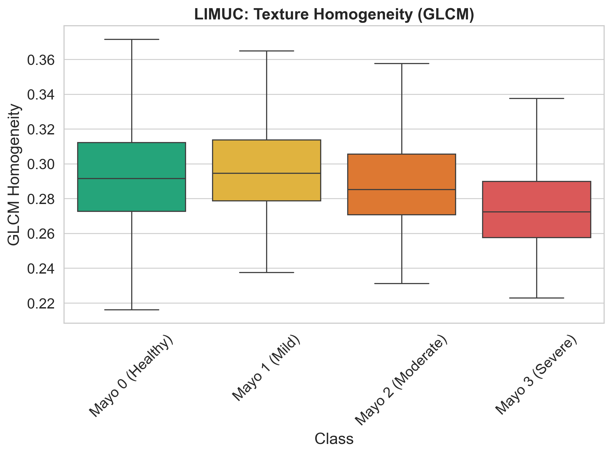
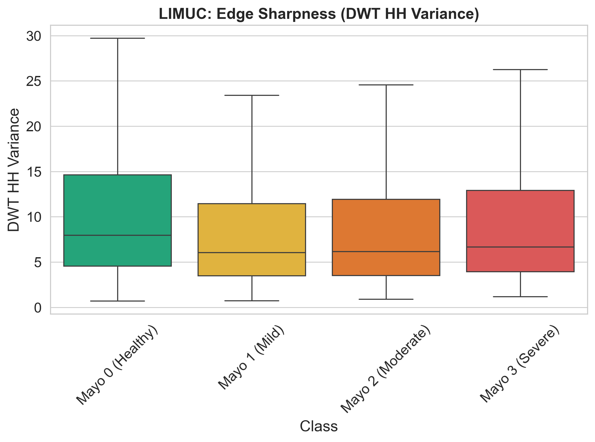
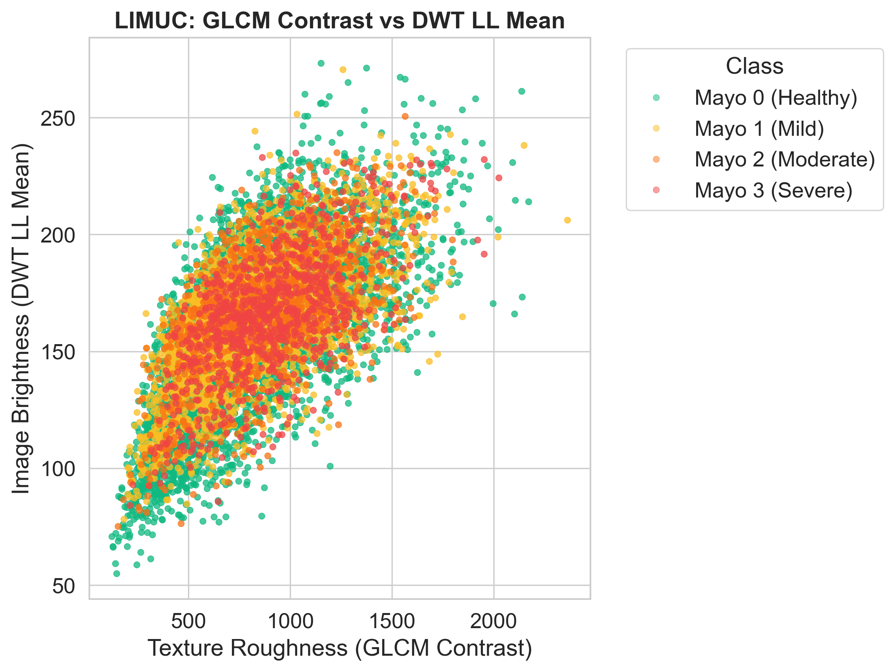
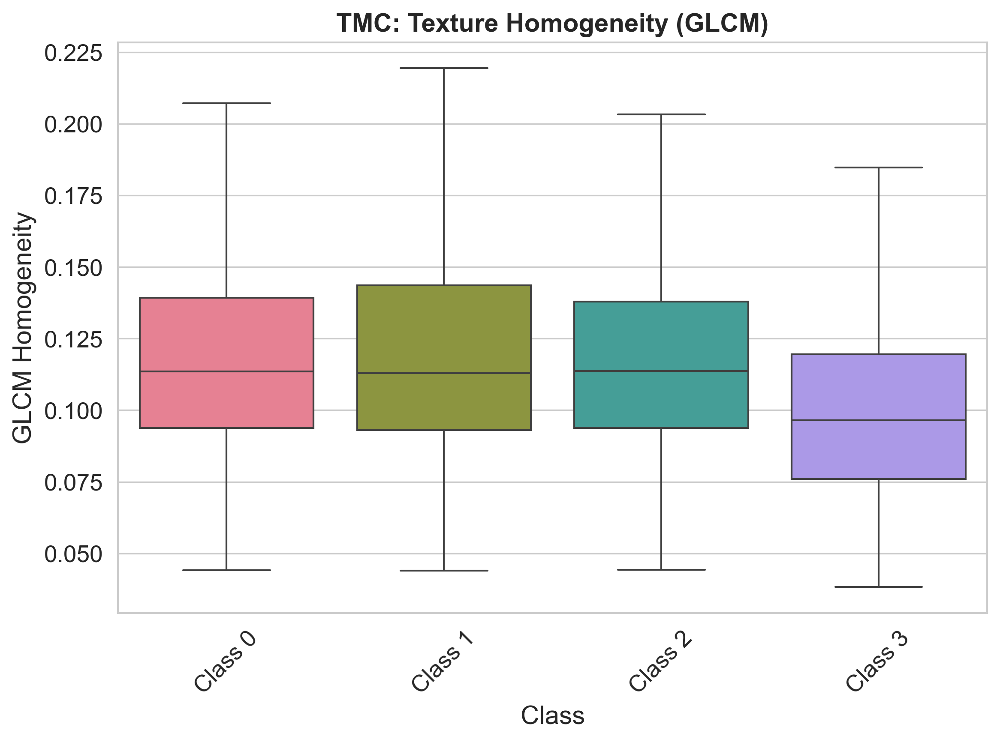
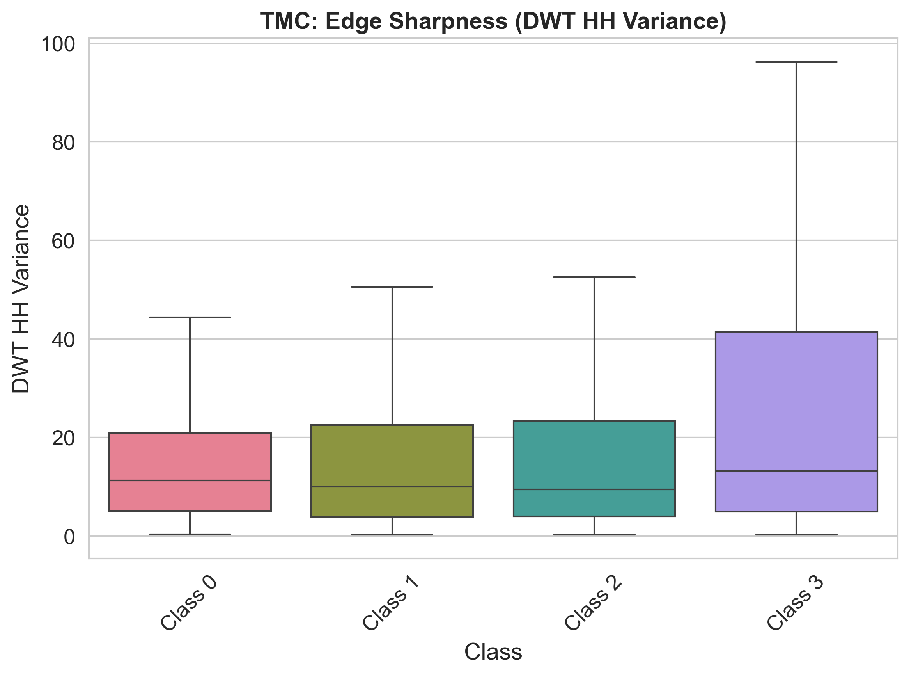
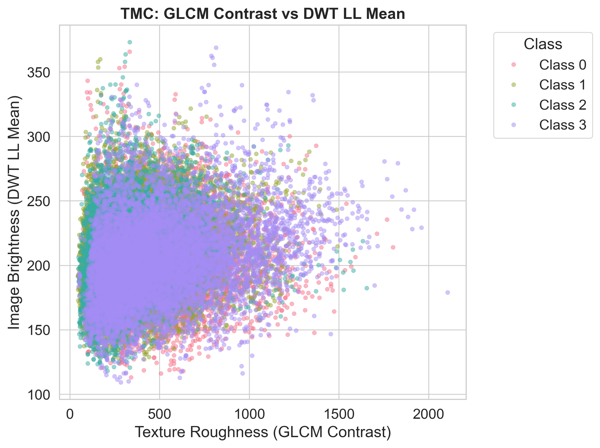

# 1. Introduction

This report presents the findings of the texture analysis performed on the **LIMUC** and **TMC** datasets. The objective is to evaluate and identify discriminatory texture features that can assist in the medical assessment of colorectal polyps.

# 2. Architecture and Pipeline

The following flowchart illustrates the architecture of our texture analysis pipeline, starting from dataset ingestion, through feature extraction using **GLCM** (Gray Level Co-occurrence Matrix) and **DWT** (Discrete Wavelet Transform), up to the **Super Agent** fusion and analysis system.

---

# 3. LIMUC Dataset Analysis

The LIMUC dataset consists of various classes of mucosal images. Below are the visual distributions of the extracted texture features.

### 3.1 GLCM Homogeneity
The homogeneity feature indicates the closeness of the distribution of elements in the GLCM to the GLCM diagonal.

### 3.2 DWT High-High Variance
The High-High (HH) variance captures the diagonal high-frequency components (fine textures) of the images.

### 3.3 Contrast vs. LL Mean
This scatter plot highlights the relationship between GLCM Contrast (local intensity variation) and DWT LL Mean (low-frequency approximation).

---

# 4. TMC Dataset Analysis

The TMC dataset provides an alternative cohort for cross-validating the texture features.

### 4.1 GLCM Homogeneity

### 4.2 DWT High-High Variance

### 4.3 Contrast vs. LL Mean

---

# 5. Conclusion

The integration of GLCM and DWT provides a robust multi-scale and statistical approach to quantifying polyp texture. The super agent architecture successfully leverages these visual biomarkers to enhance automated classification and decision support in clinical gastroenterology.
